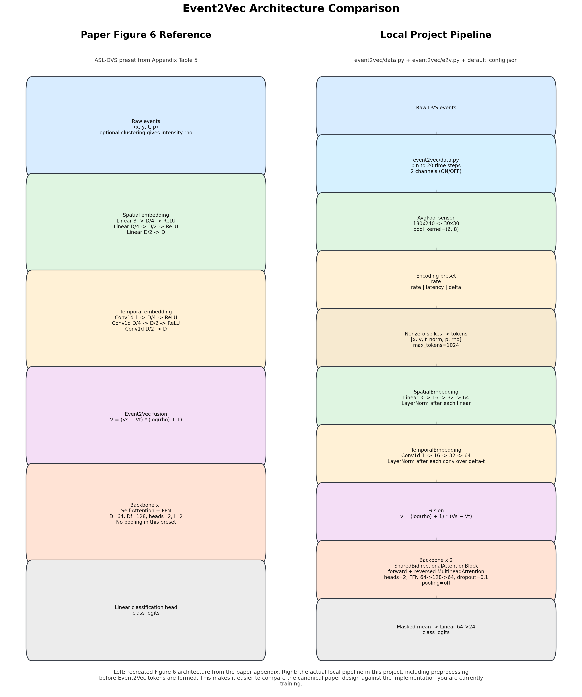
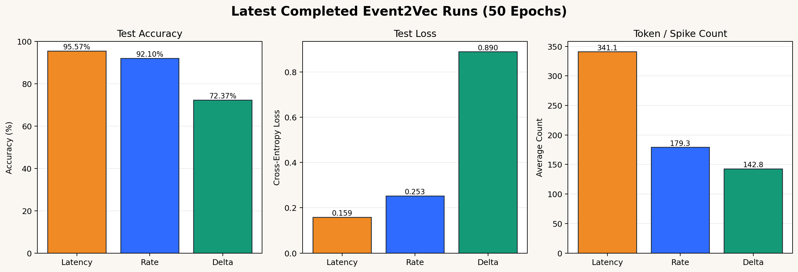
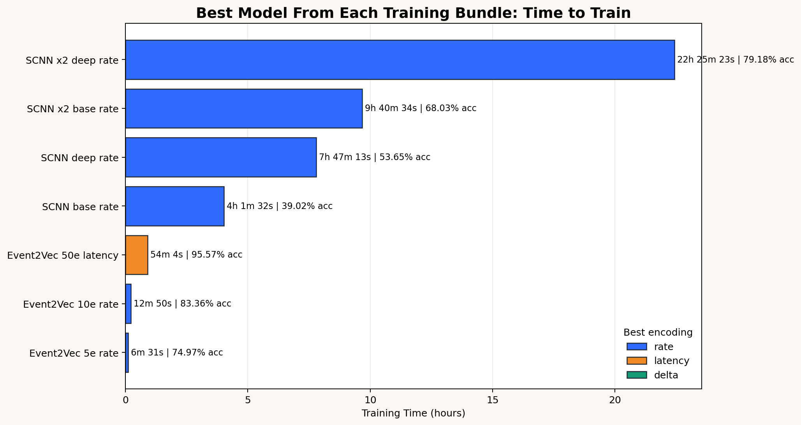

# Vision AI Project: Comparative Neuromorphic Sign-Language Recognition on ASL-DVS

Prepared on April 23, 2026. Quantitative summaries reported below were drawn from local analysis artifacts generated on April 4, 2026.

## Abstract

This report summarizes the current state of the Vision AI project as a neuromorphic sign-language recognition effort built around the ASL-DVS dataset. The project implements two primary model families: a convolutional spiking neural network (Conv-SNN) baseline and an Event2Vec-style token model. Both families are evaluated under three event encodings, namely rate, latency, and delta modulation. In addition, the project contains an exploratory EventGAN-to-Event2Vec transfer pipeline for synthetic event generation from still images. The principal finding is that the Event2Vec family substantially outperforms the completed Conv-SNN baselines on ASL-DVS. In the strongest completed run, Event2Vec with latency encoding reaches 95.57% test accuracy, while the strongest completed Conv-SNN run reaches 79.18%. The project therefore functions as both an experimental platform for representation comparison and a reproducible record of architectural and preprocessing choices for event-based recognition.

## 1. Project Scope and Aim

The project studies event-camera classification for American Sign Language recognition. Its core objective is to compare how different input encodings interact with different model families when operating on the same ASL-DVS event stream. The current codebase is organized around four practical goals:

- standardized ASL-DVS dataset setup and loading
- comparable training workflows for Conv-SNN and Event2Vec models
- automated analysis of completed runs
- exploratory extension from generated events to downstream classification

The `Kohl/` directory contains earlier standalone image and video baselines, but the main research pipeline in the present project is the ASL-DVS event-based comparison built from `scnn/`, `event2vec/`, `scripts/`, `notebooks/`, and `Analytics/`.

## 2. Data and Preprocessing

### 2.1 Dataset

The project uses the ASL-DVS dataset. According to the local setup documentation, the extracted dataset occupies approximately 19 GB and contains 100,800 `.mat` files across 24 sign classes. Each sample provides raw event arrays `(x, y, ts, pol)`. Both major training stacks apply the same coordinate sanitation and vertical flip to align the event orientation before further processing. The dataset is split stratified by class using a 70% training, 15% validation, and 15% test partition with a fixed seed of 42.

### 2.2 Conv-SNN Input Representation

The Conv-SNN stack transforms each event stream into a dense spike tensor of shape `[T, 2, H, W]`, where `T=20`, the channel dimension separates ON and OFF events, and the default sensor size remains `180 x 240`. Events are first temporally binned into 20 intervals, counted into ON/OFF spatial maps, and normalized by the maximum count within the sample. The encoding stage then depends on the selected representation:

- rate encoding applies time-varying Poisson spike conversion to the temporal volume
- latency encoding collapses the temporal bins into a static activity image and then applies time-to-first-spike conversion
- delta encoding operates on temporal differences and emphasizes changes across adjacent bins

This representation keeps the input in image-like tensor form and is therefore well suited to convolutional spiking backbones.

### 2.3 Event2Vec Input Representation

The Event2Vec stack uses a more aggressive preprocessing front-end before the learned encoder is applied. Raw events are first binned into the same 20 ON/OFF temporal frames. The `180 x 240` sensor is then average pooled with kernel `(6, 8)`, producing a `30 x 30` grid. The pooled signal is encoded by rate, latency, or delta rules, and only nonzero encoded activations are retained. These activations are then converted into sparse tokens of the form `[x, y, t, p, rho]`, where `rho` acts as an event-strength term. Finally, token count is capped, with the default Event2Vec configuration using `max_tokens=1024`.

This is a crucial methodological detail: the local Event2Vec implementation is not a strict direct raw-event pipeline. Instead, it uses a project-specific front-end that performs time binning, spatial pooling, encoding, sparsification, and token pruning before the Event2Vec model itself receives the input sequence.

## 3. Model Architectures

### 3.1 Conv-SNN Family

The Conv-SNN models are implemented in `scnn/scnn/model.py` and use `snntorch` leaky integrate-and-fire neurons with surrogate gradients. The shared block is:

`Conv2d -> BatchNorm -> LIF -> MaxPool`

Two variants are provided:

- base architecture: two convolutional stages with channel sizes `(32, 64)`
- deep architecture: three convolutional stages with channel sizes `(32, 64, 128)`

After the convolutional stages, both models flatten the final feature volume, apply dropout, pass through a hidden linear layer with a spiking activation, and finish with a final linear layer and output LIF layer. Under the local default configurations, the approximate parameter counts are:

- Conv-SNN base: 44,262,424 parameters
- Conv-SNN deep: 21,726,488 parameters

The lower parameter count of the deeper variant is a consequence of stronger spatial downsampling before the fully connected stages, which reduces the flattened feature dimension despite the added convolutional layer.

### 3.2 Event2Vec Family

The Event2Vec family is implemented in `event2vec/e2v.py`. The local default ASL-DVS configuration uses:

- embedding dimension `D=64`
- backbone depth `l=2`
- attention heads `nhead=2`
- feed-forward dimension `Df=128`
- dropout `0.1`

The learned Event2Vec encoder has three components.

First, the spatial embedding maps `(x, y, p)` through a three-layer MLP with dimensions `3 -> D/4 -> D/2 -> D`. Second, the temporal embedding processes `delta-t` by a three-stage `Conv1d` stack with dimensions `1 -> D/4 -> D/2 -> D`. Third, the two embeddings are fused by the Event2Vec rule:

`V = (

The resulting token sequence is passed into a repeated shared bidirectional attention block. Each block computes forward and reversed self-attention using shared parameters, fuses the two streams, and then applies a feed-forward subnetwork. The final representation is reduced by masked mean pooling across the token dimension and mapped to class logits through a linear head. Under the local default ASL-DVS configuration, the full Event2Vec classifier contains 96,024 parameters.

The architectural core is therefore compact compared with the Conv-SNN baselines. However, the model should be interpreted together with its preprocessing front-end, because the front-end changes the effective input representation before the Event2Vec encoder is reached.

### 3.3 EventGAN-to-Event2Vec Extension

The project also contains an exploratory pipeline that uses EventGAN to generate synthetic event streams from still ASL images and then evaluates those streams with a trained Event2Vec classifier. The pipeline synthesizes image motion, generates event volumes through EventGAN, converts those volumes back into ASL-DVS-style `.mat` event files, and classifies the generated samples with the same Event2Vec preprocessing and model stack used for real-event experiments.

This extension demonstrates an end-to-end workflow from image-domain generation to event-domain classification, but the saved results indicate that transfer from generated events remains weak. Existing summary files show exploratory accuracies ranging from approximately 6.09% to 10.57%, which is far below the performance obtained on native ASL-DVS event data.

## 4. Experimental Design

The central experiment in the project is a controlled comparison across encodings and model families. The following families were trained and analyzed:

- Conv-SNN base
- Conv-SNN deep
- Conv-SNN extended runs with additional epochs (`x2` bundles)
- Event2Vec 5-epoch runs
- Event2Vec 10-epoch runs
- Event2Vec 50-epoch runs

The comparison variable is the input representation:

- rate
- latency
- delta

Both training stacks save histories, metrics, checkpoints, and plots under `runs/`. For both families, the best checkpoint is selected by validation accuracy with validation loss used as the tie-breaker. The project also includes encoding-aware presets to reduce unfairness across representations, particularly for Conv-SNN latency and delta settings.

## 5. Quantitative Results

### 5.1 Event2Vec at 50 Epochs

Table 1 reports the strongest completed Event2Vec bundle, namely the 50-epoch comparison on ASL-DVS.

| Encoding | Best Epoch | Test Accuracy | Test Loss | Test Tokens | Best Validation Accuracy |
| --- | ---: | ---: | ---: | ---: | ---: |
| latency | 49 | 95.57% | 0.1589 | 341.13 | 95.71% |
| rate | 47 | 92.10% | 0.2530 | 179.31 | 92.31% |
| delta | 49 | 72.37% | 0.8902 | 142.75 | 72.93% |

Latency encoding produces the strongest absolute accuracy, while rate encoding offers the best efficiency-accuracy compromise. Delta encoding is the most compact representation in token count, but its accuracy gap is substantial.

Relative to the Event2Vec paper's ASL-DVS setting of 512 random events, the local project operates at materially lower average token counts. The local delta configuration uses 142.75 tokens on average, which is approximately 3.6x fewer tokens than the paper setting. The local rate configuration uses 179.31 tokens on average, which is approximately 2.9x fewer tokens. The local latency configuration uses 341.13 tokens on average, which is approximately 1.5x fewer tokens, while still reaching 95.57% test accuracy on the 24-class ASL-DVS task. This comparison is useful because it shows that the local project is operating under a reduced token budget relative to the paper's reported ASL-DVS event count.

### 5.2 Cross-Family Best Completed Results by Encoding

Table 2 compares the strongest completed Conv-SNN and Event2Vec results within each encoding family.

| Encoding | Best Completed Conv-SNN | Conv-SNN Accuracy | Best Completed Event2Vec | Event2Vec Accuracy |
| --- | --- | ---: | --- | ---: |
| rate | SCNN x2 deep | 79.18% | Event2Vec 50e | 92.10% |
| latency | SCNN deep | 32.95% | Event2Vec 50e | 95.57% |
| delta | SCNN base | 34.60% | Event2Vec 50e | 72.37% |

This comparison shows that Event2Vec outperforms the strongest completed Conv-SNN configuration under all three encodings, with especially large margins for latency and delta.

### 5.3 Training Time

A practical comparison is provided by the best-model training-time summaries.

| Best Model per Bundle | Test Accuracy | Test Loss | Training Time |
| --- | ---: | ---: | ---: |
| Event2Vec 5e rate | 74.97% | 0.7979 | 6m 31s |
| Event2Vec 10e rate | 83.36% | 0.5218 | 12m 50s |
| Event2Vec 50e latency | 95.57% | 0.1589 | 54m 4s |
| SCNN base rate | 39.02% | 2.7674 | 4h 1m 32s |
| SCNN deep rate | 53.65% | 2.7329 | 7h 47m 13s |
| SCNN x2 base rate | 68.03% | 2.5084 | 9h 40m 34s |
| SCNN x2 deep rate | 79.18% | 2.4462 | 22h 25m 23s |

The strongest completed Event2Vec runs are therefore not only more accurate but also materially faster to train than the strongest completed Conv-SNN bundles.

## 6. Interpretation

Three conclusions emerge from the current project state.

First, the Event2Vec family is the dominant completed approach in this codebase. Its best latency run reaches 95.57% test accuracy, and even its rate encoding outperforms the strongest completed Conv-SNN rate run by 12.93 percentage points.

Second, representation choice matters differently across the two model families. For Event2Vec, latency maximizes accuracy, rate provides the best compute-performance balance, and delta compresses most aggressively at a substantial accuracy cost. For Conv-SNN, rate is the only completed encoding that appears robust. The local analysis files explicitly flag the ongoing SCNN latency runs as unhealthy because validation accuracy remains near chance and output spikes nearly vanish.

Third, preprocessing is not a secondary detail in this project. The difference between the Conv-SNN and Event2Vec stacks is not only the backbone architecture. It is also the representation seen by the backbone. Conv-SNN operates on dense spike volumes, whereas the local Event2Vec implementation operates on pooled, encoded, sparsified, and token-capped event sequences.

## 7. Limitations and Next Steps

The project is strong as a comparative experimental platform, but several limitations remain.

- The local Event2Vec implementation is only partially aligned with the canonical paper architecture because it inserts a substantial preprocessing front-end before tokenization.
- The Conv-SNN results, especially for latency and delta, have already required corrective analysis and encoding-aware presets, which suggests that the model family is sensitive to training objective mismatch.
- The EventGAN-to-Event2Vec transfer pipeline remains exploratory and currently underperforms native-event classification by a wide margin.

Reasonable next steps are therefore:

- implement a stricter direct-event Event2Vec path to reduce deviation from the reference architecture
- rerun the Conv-SNN comparisons under the corrected training logic for all encodings
- investigate why generated events transfer poorly to the trained Event2Vec classifier

## 8. Reproducibility and Key Artifacts

The project is already structured for reproducibility. Dataset acquisition is documented in `DATASET_SETUP.md`; model definitions live in `scnn/scnn/` and `event2vec/`; automated run analysis is handled by `scripts/analyze_latest_runs.py`; and the main outputs are stored under `runs/` and `Analytics/`.

The most relevant local artifacts for future readers are:

- `PROJECT_OVERVIEW.md`
- `Analytics/report.md`
- `Analytics/data_analysis.md`
- `scnn_encoding_performance_analysis.md`
- `Analytics/architecture/event2vec_architecture_comparison.png`
- `Analytics/architecture/event2vec_alignment_matrix.png`

## Conclusion

In its present form, the Vision AI project is best understood as a comparative ASL-DVS research codebase centered on event representation. It ingests raw neuromorphic sign-language data, converts those events into either spike volumes or sparse tokens, trains Conv-SNN and Event2Vec families under multiple encodings, aggregates the resulting metrics, and extends the strongest local Event2Vec workflow to generated event data. The current experimental record strongly favors Event2Vec, especially under latency and rate encodings, while also making clear that preprocessing and representation design are as important as the downstream classifier itself.

## References

[1] Event2Vec: Processing Neuromorphic Events Directly by Representations in Vector Space.

[2] EventGAN: Leveraging Large Scale Image Datasets for Event Cameras.

[3] Local project artifacts: `Analytics/report.md`, `Analytics/data_analysis.md`, `scnn_encoding_performance_analysis.md`, and the run summaries under `runs/`.
